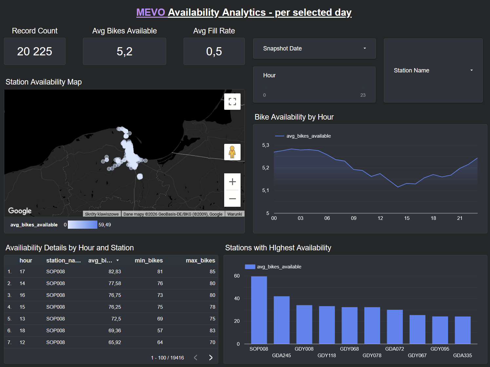
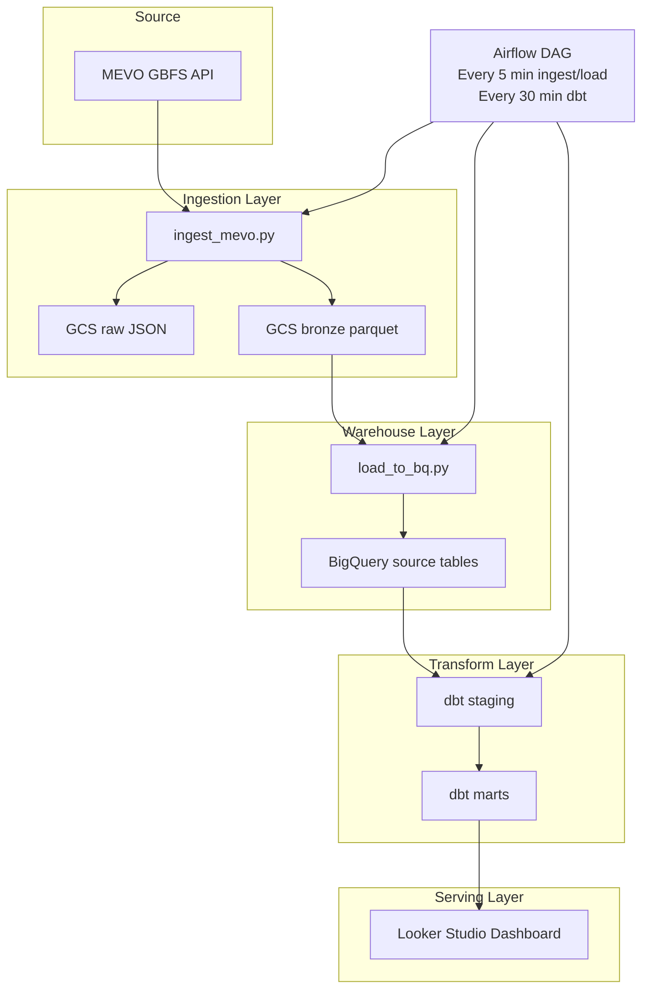
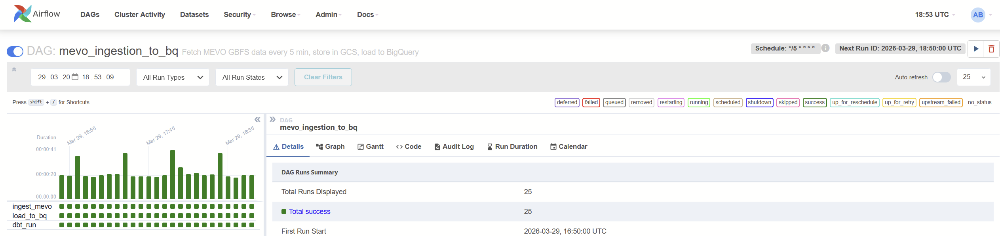
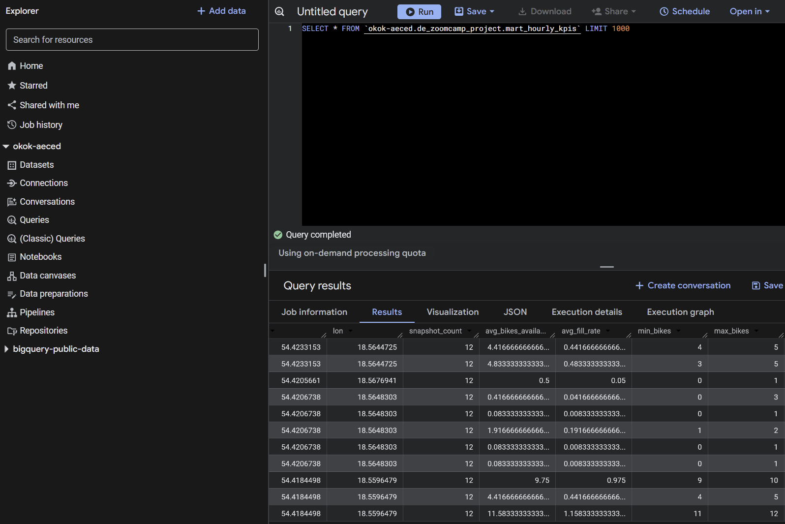

# MEVO Availability Analytics

DE Zoomcamp 2026 final project: an end-to-end batch pipeline for monitoring MEVO public bike availability in Gdansk.

## Project Goal
MEVO exposes station-level bike availability through a GBFS API. This project collects those snapshots, stores raw and curated data in Google Cloud, models the data for analytics, and exposes results in a dashboard.

The project answers some practical questions:
- Which stations tend to have the lowest bike availability?
- How does availability change during the day?
- Where are low-availability stations located on the city map?

## Dashboard
Looker Studio dashboard:
- https://lookerstudio.google.com/reporting/585fe3c8-c266-4cd6-b99b-a0e233a1ac59

## Dashboard Overview


## Architecture
Pipeline flow:



Components:

1. MEVO GBFS API
- station_status.json
- station_information.json

2. Python ingestion
- fetches current snapshot from the API
- writes raw JSON files to GCS
- writes bronze parquet files to GCS

3. BigQuery loading
- appends only the latest station_status snapshot to the fact table
- refreshes station_information as a dimension table

4. dbt transformations
- builds staging models
- builds incremental fact model
- builds dashboard mart

5. Airflow orchestration
- runs ingestion every 5 minutes
- runs BigQuery load after ingestion
- runs dbt less frequently to limit compute cost (every 30 minutes)

6. Looker Studio
- reads transformed data from BigQuery mart

## Tech Stack
- Python
- Docker
- Airflow
- Google Cloud Storage
- BigQuery
- dbt-bigquery
- Looker Studio

## Repository Structure
- airflow: Airflow Docker image, Docker Compose, DAG definition
- src: Python ingestion and BigQuery load scripts
- dbt: dbt project, sources, staging, marts

## Pipeline Details
Main DAG:
- mevo_ingestion_to_bq



Tasks:

1. ingest_mevo
- fetches station_status and station_information from the GBFS API
- stores raw JSON in GCS under raw/
- stores parquet files in GCS under bronze/

2. load_to_bq
- loads only the newest station_status parquet snapshot into BigQuery using append semantics
- prevents duplicate loads by comparing the latest snapshot timestamp with the max timestamp already loaded
- refreshes station_information in BigQuery from the latest parquet file

3. dbt_run
- runs dbt models from the dbt project mounted into the Airflow container
- executes less frequently than ingestion to reduce cost and unnecessary recomputation

## Storage Layout
Google Cloud Storage:
- raw/station_status/dt=.../hh=.../*.json
- raw/station_information/dt=.../hh=.../*.json
- bronze/station_status/station_status_*.parquet
- bronze/station_information/latest.parquet

BigQuery dataset:
- all raw and transformed tables are stored in the dataset defined by BQ_DATASET
- example dataset: de_zoomcamp_project
- source tables: station_status_snapshots, station_information
- dbt models in the same dataset: fct_station_snapshots, mart_hourly_kpis



## Source API Details
Base URL:
- https://gbfs.urbansharing.com/rowermevo.pl

Endpoints used in the project:
- /station_status.json
- /station_information.json

Authentication:
- requests use the Client-Identifier HTTP header
- the value is provided through the MEVO_CLIENT_IDENTIFIER environment variable

Example request:

```bash
curl -H "Client-Identifier: your-client-identifier" \
	https://gbfs.urbansharing.com/rowermevo.pl/station_status.json
```

Example source record shape:

```json
{
	"station_id": "123",
	"num_bikes_available": 5,
	"num_docks_available": 12,
	"is_installed": true,
	"is_renting": true,
	"is_returning": true,
	"timestamp": 1710000000
}
```

## dbt Models
Sources:
- source name: mevo
- source name is a dbt alias, not a BigQuery dataset name
- underlying BigQuery dataset is defined by BQ_DATASET, for example de_zoomcamp_project
- source tables: station_status_snapshots, station_information

Staging models:
- stg_station_status
- stg_station_information

Mart models:
- fct_station_snapshots
- mart_hourly_kpis

Modeling logic:
- station_status is treated as a snapshot fact table
- station_information is treated as a station dimension
- fill_rate is calculated as available bikes divided by station capacity
- mart_hourly_kpis aggregates hourly metrics for dashboard consumption

Example analytical fields:
- fct_station_snapshots: station_id, snapshot_ts, num_bikes_available, capacity, fill_rate
- mart_hourly_kpis: snapshot_date, hour, station_name, avg_bikes_available, avg_fill_rate, min_bikes

## Dashboard Contents
The dashboard is built on mart_hourly_kpis and contains:

1. Bike Availability by Hour
- line chart
- shows hourly trend for the selected day

2. Stations with Lowest Availability
- ranking of stations by low availability or low fill rate for the selected day

3. Station Availability Map
- geographic view of station performance using latitude and longitude

4. Lowest Availability Moments by Station
- detail table showing the worst hours by station

Recommended dashboard filters:
- snapshot_date as a single-day selector
- hour
- station_name

## Reproducibility
This project can be run locally with Docker or on any VM that has Docker available. The steps below are intentionally environment-agnostic.

### Prerequisites
- Docker
- Docker Compose v2
- Google Cloud project with BigQuery and GCS enabled
- Service account key with access to GCS and BigQuery

### GCP Setup
Create the storage and warehouse objects before starting the pipeline.

1. Create a GCS bucket:

```bash
gsutil mb -l europe-west2 gs://your-gcs-bucket
```

2. Create a BigQuery dataset:

```bash
bq --location=europe-west2 mk --dataset your-gcp-project-id:your_bigquery_dataset
```

3. Minimum IAM permissions for the service account:
- Storage Object Admin on the target bucket
- BigQuery Data Editor on the target dataset
- BigQuery Job User on the project

### 1. Clone the repository
```bash
git clone https://github.com/Argevon/data_engineering_zoomcamp_2026.git
cd data_engineering_zoomcamp_2026/de-zoomcamp-project
```

### 2. Prepare environment file for the Python scripts
Create [.env](.env) with:

```env
GCP_PROJECT_ID=your-gcp-project-id
GCP_REGION=europe-west2
GCS_BUCKET=your-gcs-bucket
BQ_DATASET=your_bigquery_dataset
MEVO_CLIENT_IDENTIFIER=your-client-identifier
MEVO_BASE_URL=https://gbfs.urbansharing.com/rowermevo.pl
```

This file is used by the Python ingestion and BigQuery load scripts.

### 3. Prepare Docker Compose environment for Airflow
Create airflow/.env with paths adjusted to your machine:

```env
MEVO_SRC_HOST_PATH=/absolute/path/to/data_engineering_zoomcamp_2026/de-zoomcamp-project/src
MEVO_ENV_HOST_PATH=/absolute/path/to/data_engineering_zoomcamp_2026/de-zoomcamp-project/.env
MEVO_DBT_HOST_PATH=/absolute/path/to/data_engineering_zoomcamp_2026/de-zoomcamp-project/dbt
GCP_KEY_DIR_HOST_PATH=/absolute/path/to/folder/with/service-account-key
GCP_KEY_FILENAME=your-key-file.json
AIRFLOW_UID=50000
```

No manual Airflow connections or Airflow variables are required. All runtime configuration is passed through environment variables and mounted files.

### 4. Prepare dbt profile
The dbt project is located in [dbt](dbt).

Default profile file:
- [dbt/profiles.yml](dbt/profiles.yml)

Before running dbt, update these fields to match your environment:
- project
- dataset
- location
- authentication method

For local development, the current example uses `oauth`.
For headless environments, you may prefer a service-account-based dbt profile.

### 5. Start Airflow
```bash
cd airflow
docker compose up airflow-init
docker compose up -d --build
docker compose ps
```

Airflow UI defaults:
- URL: http://localhost:8080
- username: admin
- password: admin

### 6. Run the pipeline
In Airflow:
- enable DAG mevo_ingestion_to_bq
- trigger one manual run
- then let the scheduler continue every 5 minutes

### 7. Validate outputs
Check BigQuery tables:
- station_status_snapshots
- station_information
- dbt mart tables

You can also test the scripts directly inside the Airflow container:

```bash
docker compose exec airflow-webserver bash -lc 'cd /opt/mevo_project && python src/ingest_mevo.py'
docker compose exec airflow-webserver bash -lc 'cd /opt/mevo_project && python src/load_to_bq.py'
docker compose exec airflow-webserver bash -lc 'cd /opt/mevo_project/dbt && dbt run --profiles-dir . --no-use-colors'
```

### Expected result
After a successful run:
- new JSON and parquet files appear in GCS
- BigQuery tables are populated with fresh snapshot data
- dbt models are materialized
- the dashboard shows updated availability metrics

## Design Decisions
- Batch instead of streaming: sufficient for 5-minute resolution and simpler to operate
- Append-only fact table: preserves full history of availability snapshots
- Incremental dbt models: reduces BigQuery cost
- Separate ingestion and transformation frequency: avoids unnecessary recomputation

## Notes on Cost and Scaling
The current version is intentionally more efficient than the initial prototype:
- only the newest fact snapshot is loaded to BigQuery
- duplicate appends are skipped
- dbt fact model is incremental
- dbt is not recomputed on every single ingestion cycle

This is still a small-volume analytics project, so storage cost should remain low. The main cost driver is BigQuery query volume, not raw storage.
